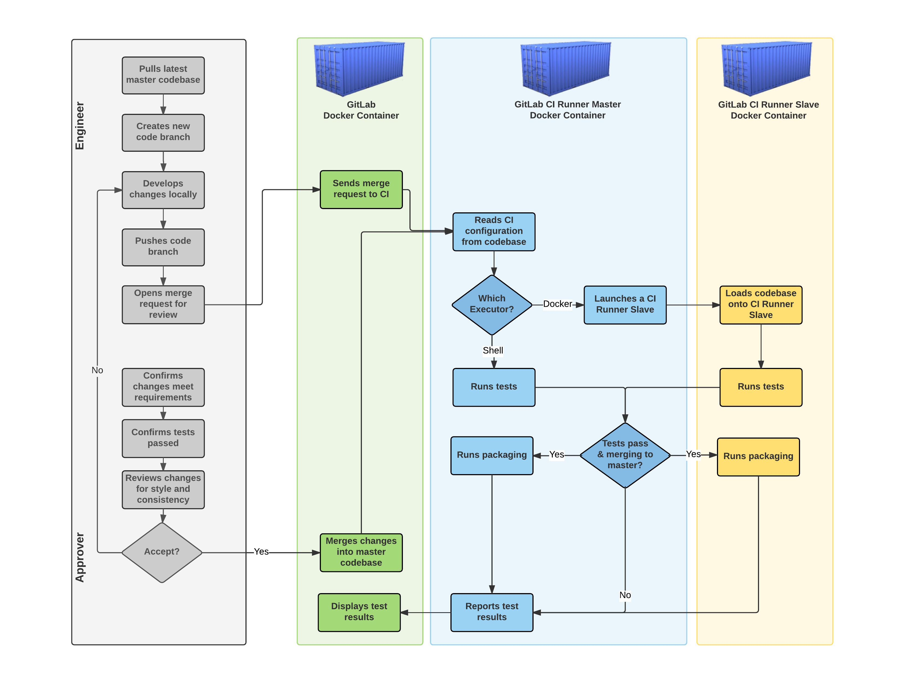
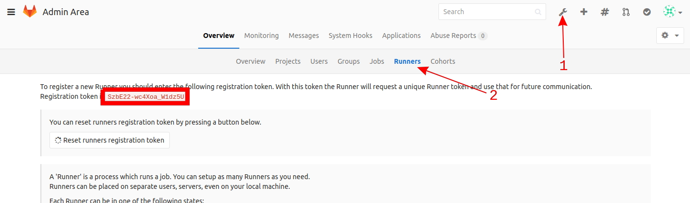
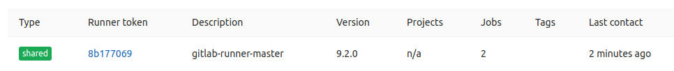

# Continuous Integration with GitLab
### Shaun Martin

---
# Overview
### 1. Goals
### 2. Process
### 3. GitLab Deployment
### 4. Development Walkthrough
### 5. Next Steps


---
# Goals: Fast, easy
.center[]

???
Keep deployments simple by isolating applications from the OS and each other.

Always run tests in a clean environment. This ensures there will be no undocumented fixes on the live system.

 _(burn the snowflakes, kill the pets)_

Make tests easy to write in whatever language. If it can run on the command line, who cares?

Less incentive to avoid them if they're easy.

Package common tests together, make them easy to use. _(eg: check_api --path --healthy_http_codes --healthy_regex)_

Balance detailed tests against development time.

_("How often will this go horribly wrong and how hard will that be to fix?" vs "How much more time do I want to sink into these *fucking tests*?")_


---
# Process .autoscale[]
???
# major components
* Two humans, one coding and one reviewing.
* GitLab: Maintains the codebase, triggers the CI Runner, and reports on test results
* GitLab CI Runner: Lightweight container acts as a job co-ordinator
* GitLab CI Runner Slave: Whatever Docker image is defined in .gitlab-ci.yml


# basic workflow
1. Make changes to Ansible code
2. Add/update check scripts
3. Commit code to a feature branch, push, open a Merge Request.
4. GitLab triggers CI Runner automatically on push to specific branches (master) or any branch with an MR
5. Approver checks tests results and reviews code.
  * They choose whether to merge changes up or request additional work.
6. GitLab CI runs the tests one more time on the master branch post-merge.
  * Packaging happens here
      * RPM
      * Ansible roles on a webserver
  * Note that packaging/pushing is *not* the same as deployment.

# The time it takes the green, blue, and yellow actions to run can be measured in seconds.
# Tens of minutes == something is very wrong


---
# GitLab Deployment: Prep
### Install Docker and docker-compose
```bash
  # docker
  sudo yum install -y yum-utils device-mapper-persistent-data lvm2
  sudo yum-config-manager \
    --add-repo https://download.docker.com/linux/centos/docker-ce.repo
  sudo yum makecache fast
  sudo yum install -y docker-ce
  sudo systemctl enable docker
  sudo systemctl start docker

  # docker-compose
  curl -s https://bootstrap.pypa.io/get-pip.py | sudo python
  sudo pip install docker-compose
```

### Move sshd to a different port
```bash
  sudo sed -i 's/#Port 22/Port 2222/g' /etc/ssh/sshd_config
  sudo semanage port --add -t ssh_port_t -p tcp 2222
  sudo firewall-cmd --add-port=2222/tcp --permanent
  sudo iptables -A IN_public_allow -p tcp --sport 2222
  # and finally, so that you know that your firewall rules were
  # applied permanently...
  sudo shutdown -r now
```
???
# Nothing exciting here
# No idea why docker isn't enabled & started on install...
# The Big Caveat: Git runs on SSH.


---
# GitLab Deployment: Initial Setup
```bash
  sudo yum install -y git
  git clone https://github.com/inhumantsar/docker-compose-gitlab.git
  cd docker-compose-gitlab
  vim demo.env  # Edit GITLAB_HOSTNAME to be something sane.
                # IP addresses are OK for demos, but not production.
  sudo ./start.sh demo
```

If you see _runner_1  | ERROR: Failed to load config stat /etc/gitlab-runner/config.toml: no such file or directory_, then congratulations, it's working.

### start.sh [env_name]
1. Reads environment variables from *env_name.env* if specified.
2. Runs `docker-compose up` which will create, recreate, or ignore Docker containers as required.
3. Attempts (and fails) to register the CI runner.

???
# As is, demo will work right up until you click on something.
# start.sh is the start of actual deployment code.
An Ansible role will probably take its place.
# I should take the sleep out
* even if the CI Runner could register,
* it would take longer than five seconds for GitLab to perform its first-boot initialization.
* docker-compose can do this with a wrapper script


---
# GitLab Deployment: Configuration
### \*.env files
```bash
# host storage locations
# note: relative paths *must* start with ./ or ../
HOST_CONFIG_PATH=/srv/gitlab/config
HOST_RNR_CONFIG_PATH=/tmp/gitlab/runner
HOST_LOG_PATH=/srv/gitlab/logs
HOST_DATA_PATH=/srv/gitlab/data

# host ports
# note that git uses ssh to communicate.
HOST_HTTP=80
HOST_HTTPS=443
HOST_SSH=22

# gitlab stuff
GITLAB_IMAGE_TAG=latest
GITLAB_HOSTNAME=gitlab.somedomain.ca

# gitlab ci runner bits
# tag 'latest' is much larger than alpine
RNR_IMAGE_TAG=alpine
RNR_REGISTRATION_TOKEN=QQzi_T1x3pLixzpyvWy9
```
???
# Used by docker-compose for variable substitution in the yaml.
# This only LOOKS like shell. docker-compose doesn't use the shell to read this.
# Bash can read this just fine. (with set -a)
# Nothing exciting here, just the usual sort of runtime config.


---
# GitLab Deployment: Configuration
### docker-compose.yml
```bash
web:
  image: 'gitlab/gitlab-ce:${GITLAB_IMAGE_TAG}'
  restart: always
  hostname: '${GITLAB_HOSTNAME}'
  # environment:
    # GITLAB_OMNIBUS_CONFIG: |
        # any config added here will override whatever's in the \
        # gitlab.rb file, if one exists.
  ports:
    - '${HOST_HTTP}:80'
    - '${HOST_HTTPS}:443'
    - '${HOST_SSH}:22'  # git interacts ssh by default, this is always \
                        # a bit of a pain to deal with.
  volumes:
    - '${HOST_CONFIG_PATH}:/etc/gitlab'
    - '${HOST_LOG_PATH}:/var/log/gitlab'
    - '${HOST_DATA_PATH}:/var/opt/gitlab'
...
```
???
# More exciting now. This defines the GitLab web service.
* `image` defines the Docker image using the ususal syntax.
* using variable subtitution to define versions.
* multiple env files, multiple environments, one docker-compose file.

# The Big Caveat: GITLAB_OMNIBUS_CONFIG.
*  initially had a bit of trouble defining this in an env file.
* It's a *big* YAML dictionary so it doesn't behave well in that simple shell variable format.
* That would probably be the ideal place for it though,
  * ...if we could make it not suck to read and update.
* If not, multiple docker-compose YAMLs wouldn't be the end of the world.


---
# GitLab Deployment: CI Runner Registration .autoscale[]
### Update demo.env
```bash
RNR_REGISTRATION_TOKEN=<new token goes here>
```
### sudo ./start.sh demo

This will recreate the CI Runner container, but ignore the GitLab container since none of its parameters changed.

???
# There's no way to get that token programmatically, so we are stuck with this process on first-boot.
# Upgrades and reboots do not require this.
# Re-run start.sh to recreate the CI Runner container with the new token.


---
# GitLab Deployment: CI Runner Registration
.autoscale[]

.footnote[Note that green in this case only means it is available to be used with any project.]

### CI Runner's job
* Launch Docker containers
* Mount cloned code in the fresh container
* Run scripts defined by `.gitlab-ci.yml` against the container

???
# Alt-tab back and refresh, bingo.


---
# Dev Walkthru: Ansible Role Highlights
### .gitlab-ci.yml
```yaml
image: williamyeh/ansible:centos7
test:
  script:
    - if [ -f 'requirements.yml' ]; then yum -y install git && \
        ansible-galaxy install -r requirements.yml; fi
    - ansible-playbook test.yml --connection=local -vvv
    - ./test/checks.sh
```
### test/checks.sh
* Check *end results*, not code.
* Look for lockfiles, running processes, predictable lines of config, etc.
* Code is checked for correctness by Ansible when it's run.
  * A linter step in gitlab-ci.yml might be a good idea.

### test.yml
* Mini-playbook that utilizes all parts of the role.
* Only needs to be updated if a role strays past the default file names.

???
# lines in `script` are individualized. no continuity between them.
# scripts are your friend. just toss them in `test/`

# checks.sh can be anything the command line can run
# exit 0 for pass, exit not-zero for fail.

---
# Dev Walkthru: Ansible Role Highlights
### requirements.yml
```yaml
# from github, overriding the name and specifying a specific tag
- src: https://github.com/bennojoy/nginx
  version: master
  name: nginx_role

# from a webserver, where the role is packaged in a tar.gz
- src: https://some.webserver.example.com/files/master.tar.gz
  name: http_role
```

## No monolith?

### Individualized repos has a knock on effect that makes life easier
* Limits potential change scope
* Limits concurrent development
* Limits test scope
* Limits deployment effort
* Saves time everywhere but `git pull`

???
### "Shit, that's going to be a lot of repos."
Yep!


_Testing_ becomes easier which makes

_code review_ easier which makes

_versioning_ easier which makes

_packaging_ easier which makes

_dependencies_ easier

which makes _LIFE EASIER_.


---
# Dev Walkthru: Live Demo!
.autoscale[]
???
# git Flow
* "develop" branch would probably be "lab" branch for us if we like this process.
* i prefer to be more explicit.
* have lab and prod config files, pass them as params to the deployer.

# in terminal or in webui
1. Edit a file,
2. commit to branch,
3. push to gitlab,
4. open merge request,
5. check build status.


---
# Next Steps
### Deploy a CI Runner and a GitLab somewhere.
### Define a packaging method for Ansible code.
### Launch a repository for Ansible code.
### Move some "live" Ansible code in, write checks for it, get it packaging.
### Launch a repository for RPMs? PyPI? Gems?
???
* CI Runner can operate behind an authenticated proxy. Is that something we could work with?
*
